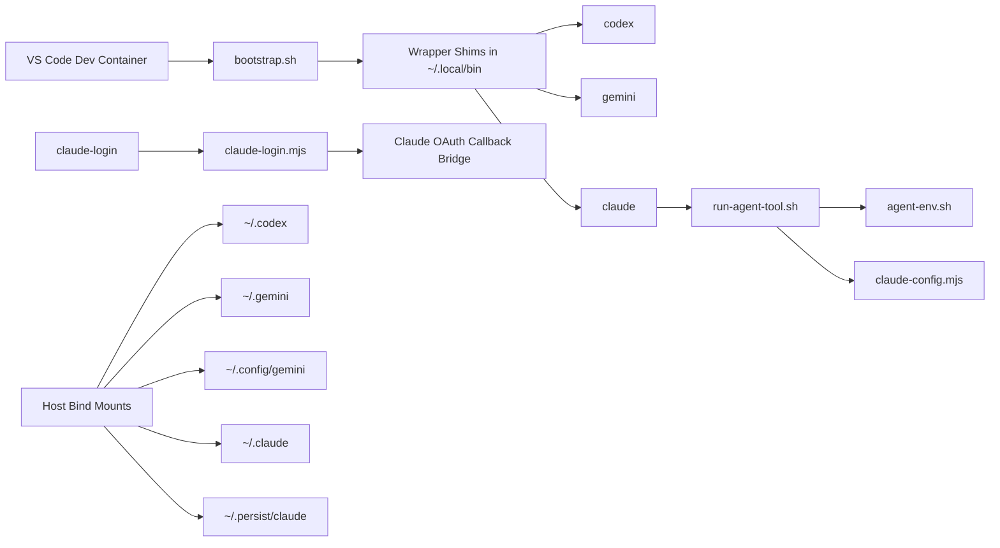

# Multi-Agent Devcontainer

<p align="center">
  Reproducible VS Code Dev Container for <strong>Codex</strong>, <strong>Gemini CLI</strong>, and <strong>Claude Code</strong>.
</p>

<p align="center">
  Built for local Docker Desktop + VS Code Dev Containers, with persistent agent state outside the repository.
</p>

## Overview

This repository is not an application package. It is a devcontainer setup that gives you a repeatable coding environment for three local AI coding agents:

| Tool | Purpose | Notes |
| --- | --- | --- |
| `codex` | OpenAI coding agent CLI | Wrapped to run with the container's CA and proxy settings |
| `gemini` | Google Gemini CLI | Uses persistent home/config mounts |
| `claude` | Anthropic Claude Code | Wrapped to harden login and persist account state |

The container is designed for local use, not Codespaces. Agent state is stored on the host so rebuilds do not wipe logins and local preferences.

## What This Setup Does

- Creates shell wrappers for `codex`, `gemini`, `claude`, `claude-login`, `claude-bridge`, and `agent-doctor`
- Persists agent data through host bind mounts outside the repo
- Normalizes proxy and CA handling for the wrapped CLIs
- Hardens Claude login inside devcontainers, including IPv4/IPv6 callback handling
- Restores Claude runtime state so `claude auth status` and interactive `claude` stay aligned

## Architecture



## Repository Layout

```text
.devcontainer/
  Dockerfile
  devcontainer.json
  devcontainer.env.example
  README.md
  scripts/
  windows/
AGENTS.md
README.md
```

## Requirements

- VS Code with the `Dev Containers` extension
- Docker Desktop
- Local Docker engine
- Optional on Windows: `px` for corporate proxy environments

## Quick Start

1. Open the repository in VS Code.
2. Run `Dev Containers: Rebuild and Reopen in Container`.
3. Inside the container, verify the environment:

```bash
agent-doctor
codex --version
gemini --version
claude --version
```

## Persistent State

Agent state is intentionally stored outside the repository:

- macOS/Linux: `~/.devcontainer-agent-state/remote-test/`
- Windows: `%USERPROFILE%\.devcontainer-agent-state\remote-test\`

Mounted locations inside the container:

| Container path | Purpose |
| --- | --- |
| `/home/node/.codex` | Codex state |
| `/home/node/.gemini` | Gemini state |
| `/home/node/.config/gemini` | Gemini config |
| `/home/node/.claude` | Claude credentials and runtime data |
| `/home/node/.persist/claude` | Persistent Claude root config mirror |

### Reset

1. Close the container.
2. Delete the host folder `~/.devcontainer-agent-state/remote-test/` or `%USERPROFILE%\.devcontainer-agent-state\remote-test\`.
3. Rebuild the container.

## Claude Login

Use the hardened helper:

```bash
claude-login
```

`claude-login` exists because Claude's browser login flow behaves differently in a devcontainer than it does on a plain local shell.

It currently does all of the following:

- starts `claude auth login` with `--dns-result-order=ipv4first`
- detects the local OAuth callback listener even when Claude prints only the platform callback URL
- starts the IPv4 to IPv6 bridge only when the callback listener requires it
- syncs `~/.claude.json` with `~/.persist/claude/.claude.json`
- ensures Claude onboarding state exists so interactive `claude` does not fall back into the welcome/login setup
- launches `claude` automatically after a successful login

If you only want the login step:

```bash
claude-login --login-only
```

### Important Claude Detail

Claude stores account context in two places:

- `~/.claude/.credentials.json`
- `~/.claude.json`

Persisting only `~/.claude/` is not enough. This repository explicitly mirrors `~/.claude.json` into `~/.persist/claude/.claude.json` and restores it on startup.

### Expected First Interactive Prompt

After a valid Claude login, the next screen may still ask whether you trust the current workspace. That is a workspace trust prompt, not an authentication failure.

## Proxy and CA Support

Default local setup:

- `USE_LOCAL_PROXY=0`
- `USE_CORP_CA=0`

Corporate options:

- use `USE_LOCAL_PROXY=1` and start `.devcontainer/windows/start-px.ps1` on Windows
- or set `HTTP_PROXY` / `HTTPS_PROXY` in `.devcontainer/devcontainer.env`
- place corporate certificates in `.devcontainer/certs/*.crt` and enable `USE_CORP_CA=1`

Helper scripts:

```bash
bash .devcontainer/scripts/proxy.sh
bash .devcontainer/scripts/corp-ca.sh
```

## Key Scripts

| Script | Purpose |
| --- | --- |
| `.devcontainer/scripts/bootstrap.sh` | Creates wrappers and syncs persistent state |
| `.devcontainer/scripts/run-agent-tool.sh` | Launches wrapped CLIs with normalized environment |
| `.devcontainer/scripts/agent-env.sh` | Resolves real binaries and CA/proxy settings |
| `.devcontainer/scripts/claude-login.mjs` | Hardened Claude login flow |
| `.devcontainer/scripts/claude-config.mjs` | Restores Claude onboarding/runtime state |
| `.devcontainer/scripts/doctor.sh` | Diagnostics for wrappers, paths, and localhost behavior |

## Manual Verification

Use these checks after changing the devcontainer or wrapper scripts:

```bash
bash .devcontainer/scripts/bootstrap.sh
agent-doctor
codex --version
gemini --version
claude --version
claude auth status
```

For Claude login changes, also test:

```bash
claude-login --login-only
claude
```

## Security Notes

- Do not commit `.devcontainer/devcontainer.env`
- Do not commit files under `.devcontainer/certs/`
- Keep proxy credentials, tokens, and corporate CA material local only

## Maintainer Notes

- Primary repo overview lives in this `README.md`
- Maintainer workflow rules live in `AGENTS.md`
- Devcontainer-specific implementation details live in `.devcontainer/README.md`
