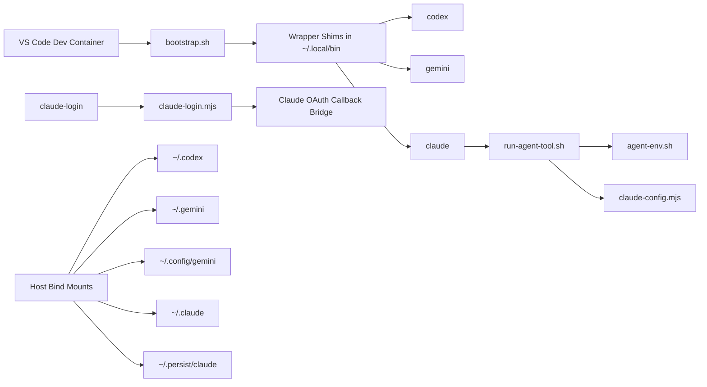

# Multi-Agent Devcontainer

<p align="center">
  Reproducible VS Code Dev Container for <strong>Codex</strong>, <strong>Gemini CLI</strong>, and <strong>Claude Code</strong>.
</p>

<p align="center">
  Built for local Docker Desktop + VS Code Dev Containers, with persistent agent state outside the repository.
</p>

<p align="center">
  <code>codex</code> · <code>gemini</code> · <code>claude</code> · <code>claude-login</code> · <code>agent-doctor</code>
</p>

## TL;DR

> [!IMPORTANT]
> This repo gives you a local VS Code devcontainer where `codex`, `gemini`, and `claude` run through repo-managed wrappers instead of the raw binaries.
>
> State survives rebuilds because it is stored in host bind mounts under `~/.devcontainer-agent-state/remote-test/` or `%USERPROFILE%\.devcontainer-agent-state\remote-test\`.
>
> On first start, `initializeCommand` creates the required host directories before Docker validates the bind mounts.
>
> For Claude, use `claude-login`, not plain `claude auth login`.

| If you want to... | Use this |
| --- | --- |
| Start the environment | `Dev Containers: Rebuild and Reopen in Container` |
| Verify the setup | `agent-doctor` |
| Log into Claude | `claude-login` |
| Check Claude auth only | `claude auth status` |
| Reinstall wrappers | `bash .devcontainer/scripts/bootstrap.sh` |
| Reset everything | Delete the host state folder and rebuild |

```bash
agent-doctor
claude-login
```

## Overview

This repository is not an application package. It is a development container that gives you a repeatable local environment for three AI coding CLIs:

| Tool | Purpose | Why it is wrapped |
| --- | --- | --- |
| `codex` | OpenAI coding agent CLI | Normalizes proxy, CA, and binary resolution |
| `gemini` | Google Gemini CLI | Uses persistent home and config mounts |
| `claude` | Anthropic Claude Code | Needs extra login, persistence, and runtime-state handling |

The design goal is simple: rebuild the container without losing agent state, and make each CLI behave predictably inside a devcontainer.

---

## Quick Start

1. Open the repository in VS Code.
2. Run `Dev Containers: Rebuild and Reopen in Container`.
3. Inside the container, verify the setup:

```bash
agent-doctor
codex --version
gemini --version
claude --version
```

> [!TIP]
> If Claude is the main reason you are here, the shortest working path is: rebuild container -> `agent-doctor` -> `claude-login`.

---

## How It Works

When the devcontainer starts, the environment is assembled in this order:

1. VS Code launches the devcontainer from `.devcontainer/devcontainer.json`.
2. `initializeCommand` creates the required host state directories before Docker starts the container.
3. `bootstrap.sh` runs on both `postCreateCommand` and `postStartCommand`.
4. Bootstrap creates wrapper shims in `~/.local/bin`, so `codex`, `gemini`, and `claude` resolve to the repo-managed wrappers before the real binaries.
5. Those wrappers resolve the actual installed binary, clean up CA and proxy environment variables, and then launch the real CLI.
6. Agent state is read from bind mounts on the host, so rebuilds do not wipe local logins and config.
7. Claude gets additional handling for OAuth callback routing, root config persistence, and onboarding/runtime state.

This is the core mental model for the repository: the tools you type are wrapper entrypoints, not the raw binaries.

> [!NOTE]
> The wrapper layer is the product here. The container is intentionally opinionated so the CLIs behave consistently after rebuilds, proxy changes, and Claude login flows.

## What Happens When You Run Each Command

| Command | What actually happens |
| --- | --- |
| `codex` | Wrapper resolves the real Codex binary, normalizes CA and proxy variables, then launches Codex |
| `gemini` | Wrapper resolves the real Gemini binary, normalizes environment, then launches Gemini with its persistent directories mounted |
| `claude-login` | Login helper starts `claude auth login`, detects the local callback listener, applies the IPv4/IPv6 workaround if needed, syncs Claude config, completes runtime state, then starts `claude` |
| `claude` | Wrapper restores `~/.claude.json`, ensures Claude runtime and onboarding state exist, launches the real Claude binary, then persists root config back to the mounted location |
| `agent-doctor` | Runs basic diagnostics for wrapper resolution, writable directories, localhost behavior, and Claude config files |

---

## Architecture



---

## Persistent State

Agent state is intentionally stored outside the repository:

- macOS/Linux: `~/.devcontainer-agent-state/remote-test/`
- Windows: `%USERPROFILE%\.devcontainer-agent-state\remote-test\`

The required subdirectories are created automatically on the host before container startup:

- `codex`
- `gemini`
- `gemini-config`
- `claude`
- `claude-persist`

Mounted locations inside the container:

| Container path | Purpose |
| --- | --- |
| `/home/node/.codex` | Codex state |
| `/home/node/.gemini` | Gemini state |
| `/home/node/.config/gemini` | Gemini config |
| `/home/node/.claude` | Claude credentials and runtime files |
| `/home/node/.persist/claude` | Persistent storage for Claude root config |

### Why Claude Needs More Than One Path

Claude account state is split across multiple files:

- `~/.claude/.credentials.json` stores OAuth credentials
- `~/.claude.json` stores root-level Claude account and runtime context
- `~/.persist/claude/.claude.json` is the persistent mirror used across container rebuilds

This split is important. `claude auth status` can look correct while interactive `claude` still behaves like a first run if `~/.claude.json` is missing or incomplete. The wrapper layer exists partly to keep these files in sync.

> [!TIP]
> If interactive `claude` behaves strangely after a rebuild, check Claude root config persistence before assuming the OAuth token is broken.

### Reset

1. Close the container.
2. Delete `~/.devcontainer-agent-state/remote-test/` or `%USERPROFILE%\.devcontainer-agent-state\remote-test\`.
3. Rebuild the container.

---

## Claude Login

Use this command for browser login:

```bash
claude-login
```

### Why plain Claude login is fragile in a devcontainer

Claude's login flow assumes a local callback path that is easy on a normal machine but less reliable in a container:

- `localhost` may resolve IPv6-first inside the container
- recent Claude versions may print only the platform callback URL instead of the local callback port
- Claude stores auth and runtime context in different places
- interactive `claude` also checks onboarding/runtime state, not just OAuth validity

### What `claude-login` fixes

- starts login with `--dns-result-order=ipv4first`
- detects the actual callback listener opened by Claude
- starts the IPv4 to IPv6 bridge only when needed
- syncs `~/.claude.json` into persistent storage
- ensures onboarding state exists so `claude` does not fall back into setup screens
- auto-starts `claude` after a successful login

If you only want the login step:

```bash
claude-login --login-only
```

### What success looks like

After a successful login:

- `claude auth status` reports that the account is logged in
- `claude` opens normally instead of the login setup flow
- the next prompt may be workspace trust, not authentication

### Common confusion

If Claude asks whether you trust the current workspace, that is not a login failure. It is Claude's workspace trust gate for the current folder.

> [!WARNING]
> `claude auth status` and interactive `claude` are related, but not identical checks. OAuth can be valid while runtime or onboarding state is still incomplete.

---

## Troubleshooting By Symptom

### Browser login completes, but Claude still looks logged out

Run:

```bash
claude auth status
agent-doctor
```

Most likely cause: root config was missing or stale, not the OAuth token itself.

### `claude auth status` says logged in, but `claude` shows setup

Most likely cause: interactive Claude is missing runtime or onboarding state in `~/.claude.json`. The wrapper now restores and completes that state before launch.

### Claude opens a trust prompt after login

This is expected. Workspace trust is separate from authentication.

### Wrappers do not seem to be used

Run:

```bash
which claude
which codex
which gemini
bash .devcontainer/scripts/bootstrap.sh
```

The expected wrapper path is under `~/.local/bin/`.

### Proxy or CA problems

Check:

```bash
agent-doctor
echo "$HTTP_PROXY"
echo "$NODE_EXTRA_CA_CERTS"
```

Then review `.devcontainer/devcontainer.env`, `.devcontainer/scripts/proxy.sh`, and `.devcontainer/scripts/corp-ca.sh`.

---

## Repository Layout

```text
.devcontainer/
  Dockerfile
  devcontainer.json
  devcontainer.env.example
  README.md
  scripts/
  windows/
AGENTS.md
README.md
```

---

## Key Scripts

| Script | Purpose |
| --- | --- |
| `.devcontainer/scripts/bootstrap.sh` | Creates wrappers, shims, and persistent-state sync |
| `.devcontainer/scripts/run-agent-tool.sh` | Launches wrapped CLIs with normalized environment |
| `.devcontainer/scripts/agent-env.sh` | Resolves real binaries and CA/proxy settings |
| `.devcontainer/scripts/claude-login.mjs` | Hardened Claude login and callback handling |
| `.devcontainer/scripts/claude-config.mjs` | Restores Claude runtime and onboarding state |
| `.devcontainer/scripts/doctor.sh` | Diagnostics for wrappers, mounts, and localhost resolution |

---

## Proxy and CA Support

Default local setup:

- `USE_LOCAL_PROXY=0`
- `USE_CORP_CA=0`

Corporate options:

- use `USE_LOCAL_PROXY=1` and start `.devcontainer/windows/start-px.ps1` on Windows
- or set `HTTP_PROXY` and `HTTPS_PROXY` in `.devcontainer/devcontainer.env`
- place certificates in `.devcontainer/certs/*.crt` and enable `USE_CORP_CA=1`

Helper scripts:

```bash
bash .devcontainer/scripts/proxy.sh
bash .devcontainer/scripts/corp-ca.sh
```

---

## Manual Verification

Use these checks after changing the devcontainer or wrapper scripts:

```bash
bash .devcontainer/scripts/bootstrap.sh
agent-doctor
codex --version
gemini --version
claude --version
claude auth status
```

For Claude login behavior, also test:

```bash
claude-login --login-only
claude
```

---

## Security Notes

- Do not commit `.devcontainer/devcontainer.env`
- Do not commit files under `.devcontainer/certs/`
- Keep proxy credentials, tokens, and corporate CA material local only

---

## Further Reading

- Root overview: `README.md`
- Maintainer guidance: `AGENTS.md`
- Container-focused details: `.devcontainer/README.md`
